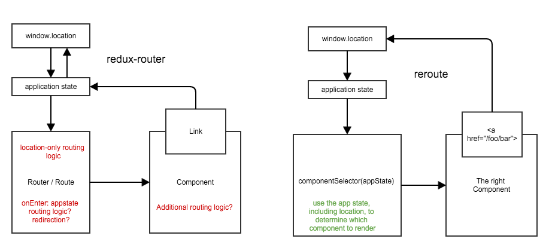

# reroute

Location reducer and routing helpers for [`redux`](https://github.com/rackt/redux).

## Rationale

**Context** We are using an application state based rendering flow (redux)

**Questions**
* How to deal with the location changes?
* Should the URL be the result of the app state?  - Or -
* Should the application state be the result of the URL?
* Where do I put my non-location based routing logic (ex: authentication)?
* How to implement deep linking?

**Choices made by `reroute`**

* The application state remains the only source of truth
* The location, or url, is only a part of the application state
* It is up to the developer to build the decision tree resulting in the intended UI
* `reroute` = minimal base + optional helpers
* Based on idiomatic `redux` principles (action > reducer > app state > render loop)
* There is not concept of `ViewContainer`, `Router` or `Route` components
* Determine which component to render by using a component `selector` (`(appState) => Component`, as defined by [`reselect`](https://github.com/rackt/reselect)), anywhere in your application

## Features

1. reduce the location into the application state, providing:
  1. matched url pattern
  1. url parameters (within the path or query string)
1. optionally use provided helpers to generate your component `selector(s)` (as defined by [`reselect`](https://github.com/rackt/reselect))

## The minimal example ([source](./examples/minimalist/index.js))

In this example, we demonstrate the base principles:

* declare some route patterns (using [`url-pattern`](https://github.com/snd/url-pattern) syntaxe)
* connect `reroute` to the store
* decide which component to show depending on app state
* pick url params from app state
* navigate using regular links

Note: helpers provided by `reroute` remove the need for most of the boilerplate shown in this example.

```js
import React, { Component } from 'react';
import { render } from 'react-dom';
import { Provider, connect } from 'react-redux';
import { createStore, combineReducers } from 'redux';

import { connectToStore, location } from '../../index';

// Regular example actions and reducers
const increment = (by = 1) => ({type: 'INCREMENT', by});
const decrement = (by = 1) => ({type: 'DECREMENT', by});

const counter = (state = 0, {type, by}) => {
  switch (type) {
    case 'INCREMENT':
      return state + by;
    case 'DECREMENT':
      return state - by;
    default:
      return state;
  }
}

// redux reducers and store creation
const rootReducer = combineReducers({
  location, // the `reroute` location reducer
  counter // your own reducers
});

const store = createStore(rootReducer);

// Define your route templates
// the object keys aren't used internally, they are just for latter reference
// `connectToStore` actually transforms it to an array of string.
const routes = {
  home: '/',
  buttons: '/path/to/buttons(/by/:by)',
  total: '/path/to/total'
};

// Connect the `reroute` location handler to the store
const disconnect = connectToStore(store, routes);

// Regular application top level components connect to redux
// Only to get access to `actions` and bits of the app state
@connect((state) => ({by: state.location.urlParams.by}), { increment, decrement })
class ButtonsPage extends Component {
  render() {
    const by = parseInt(this.props.by || 1);
    return (
      <div>
        <button onClick={this.props.increment.bind(this, by)}>Increment</button>
        <button onClick={this.props.decrement.bind(this, by)}>Decrement</button>
        <div>By {by}</div>
      </div>
    );
  }
}

@connect(({counter}) => ({counter}))
class TotalPage extends Component {
  render() {
    const { counter } = this.props;
    return (
      <div>
        <h1>Total: {counter}</h1>
      </div>
    );
  }
}

// This component is responsible for picking and rendering the right component
// It connects to get the `location.matchedRoute` value of the app state
//
// Note: this is not necessary when using a component selector, this is only
// meant to demonstrate the `reroute` principles.
@connect(state => ({ matchedRoute: state.location.matchedRoute }))
class ComponentSwitch extends Component {
  render() {
    const {matchedRoute} = this.props;

    // Simply render the right component based on `matchedRoute`
    switch (matchedRoute) {
      case routes.home: return <div>Home page</div>
      case routes.buttons: return <ButtonsPage/>
      case routes.total: return <TotalPage/>
      default: return <div>unknown route</div>
    }
  }
}

// The top level component, just a list of links and the component switch
// Note how we only use regular `<a>` elements for navigation
class App extends Component {
  render() {
    return (
      <Provider store={store}>
        <div>
          <h1>Links</h1>
          <div><a href={`#${routes.home}`}>Home</a></div>
          <div><a href='#/path/to/buttons'>Increment-Decrement Buttons</a></div>
          <div><a href='#/path/to/buttons/by/2'>Increment-Decrement Buttons by 2</a></div>
          <div><a href='#/path/to/buttons/by/5'>Increment-Decrement Buttons by 5</a></div>
          <div><a href={`#${routes.total}`}>Total</a></div>
          <div><a href='#unknown'>Unknown</a></div>
          <h1>View</h1>
          <ComponentSwitch/>
        </div>
      </Provider>
    );
  }
}

render(<App/>, document.getElementById('app-container'));
```

## API

No comprehensive API doc for now, have a look at the examples.

However, here are the bits of code provided by `reroute`:

* `connectToStore(store, routes)`, must-call, to dispatch location related actions
* `location` reducer, filling the app state with `matchedRoute` and `urlParams`
* `Link` component to generate links from route patterns and url parameters
* `createComponentSelector` helper to create component selector
* `noMatchRouteSelector` helper to generate a selector returning whether a route is matched

### `createComponentSelector`

This helper is meant to ease route-pattern mapping to components.

```js
// [usual dependencies]
import { createComponentSelector, connectToStore, NO_MATCH } from `reroute`;

//
const routes = {
  home: '/',
  users: '/users',
  user: '/users/:userId'
};

connectToStore(store, routes);

// Create a component selector that will use `matchedRoute` to
// pick the right component
const componentSelector = createComponentSelector({
  [routes.home]: () => <Home>,
  [routes.users]: () => <Users>,
  [routes.user]: (urlParams) => <User userId={urlParams.userId}>,
  [NO_MATCH]: () => <Home routingError='Sorry but I think you are lost.'>
});

// Connect your component using create componentSelector
@connect(componentSelector)
class App extends React.Component {
  render() {
    // `this.props.component` is the component you should render
    const { component } = this.props;
    return <div class="app">{component}</div>
  }
}
```

If the logic of your app routing is more complex than just mapping URL
to component (like authentication), you should still use this helper to
create component selectors and combine them using [`reselect`](https://github.com/rackt/reselect) as in [this
example](./examples/authentication/).

## Recipes / Examples

* [more generic route to component routing](./examples/basic/)
* [protect some views behing authentication](./examples/authentication/)

## TODO

* More examples
* `#`-free path handling
* asynchronous location change, allowing things like loading data
* tests, once the API is a little bit stabilized

## Why not `redux-router`?

We found out than the routing provided by `redux-router` does not let you integrate non-location based routing easily.

You will have to work against it to inject your non-location routing logic, by using either:

* more routing logic in the component `Router` outputs, splitting the routing logic into location vs. non-location code.
* redirecting using `onEnter`, creating some weird non-idiomatic loops.
* re-wrapped and replace the reducer `react-redux` uses
* ???

With `reroute`, you don't have to work around anythings. You build the routing by composing location and non-location related application state.


